<!-- _class: lead
-->

# Как ускорить запросы к InfluxDB с помощью InfluxQL Continuous Queries и разделения данных

## Смирнов Вячеслав

###  Miro 

<!--

-->

---
<!-- _class: title -->

# Ускоряю и тестирую инфраструктурные сервисы в  Miro
## Развиваю сообщество нагрузочников
### @qa_load


<!-- 
Повышаю качество более десяти лет. Занимаюсь системой дистанционного банковского обслуживания юридических лиц. Основной профиль моей работы — тестирование производительности. Развиваю сообщество инженеров по тестированию производительности, помогая коллегам в telegram чате «QA — Load & Performance».
-->

---
<!-- _class: main -->

# Об ускорении __InfluxDB__ глазами инженера по нагрузке 


---
# Содержание

1. ⁉️ Когда оптимизация __InfluxDB__ важна
1. ⚙️ Разделение данных на разные базы и серверы __InfluxDB__
1. ⚙️ «Архивирование»  базы __InfluxDB__ в __Grafana__
1. 🛠️ Сокращение фильтров по тегам в __Grafana__
1. ⚙️ Сокращение метрик из __JMeter__, __Gatling__, ...
1. ⚙️ Кеширование  ответов от __InfluxDB__ с __nginx__ 
1. 📊 Мониторинг производительности __InfluxDB__
1. ⚙️ Конфигурирование сервера __InfluxDB__
1. 🔬 Анализ логов __InfluxDB__
1. 🔬 Замер длительности ответа на запрос из __Grafana__ в __InfluxDB__
1. 🚀 Подготовка данных для ответа с помощью __Continuous Queries__
1. ⚙️ Смена БД __InfluxDB__ v1.8, __InfluxDB__ v2, __VictoriaMetrics__ или __ClickHouse__

---

<!-- _class: main -->

# Когда и для кого оптимизация __InfluxDB__ важна

---
# __1.__ ⁉️ Когда оптимизация __InfluxDB__ важна

- Большой продукт

- Вы отвечаете за инфраструктуру тестирования
- Много тестов производительности с __k6__, __JMeter__, __Gatling__, __Yandex.Tank__, ...
- Хранятся данные за годы и строятся тренды
- И вы хотите ускорить __InfluxDB__ OpenSource


---

# Большой продукт

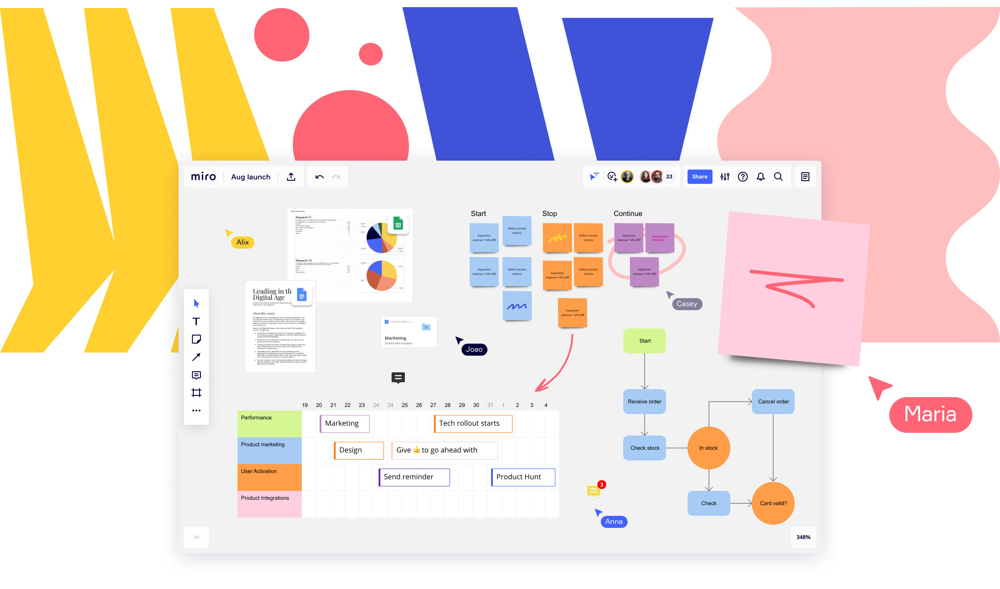

---

# Вы отвечаете за инфраструктуру тестирования

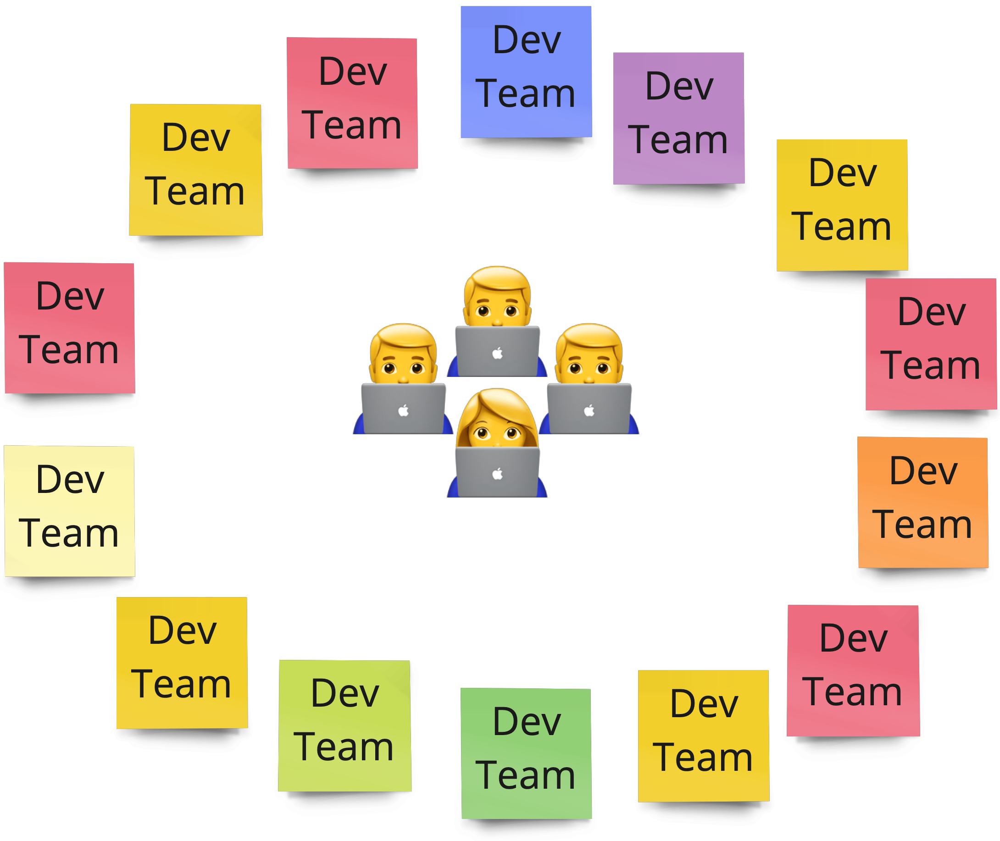

---

# Много тестов производительности с __Yandex.Tank__, __k6__, __JMeter__, __Gatling__

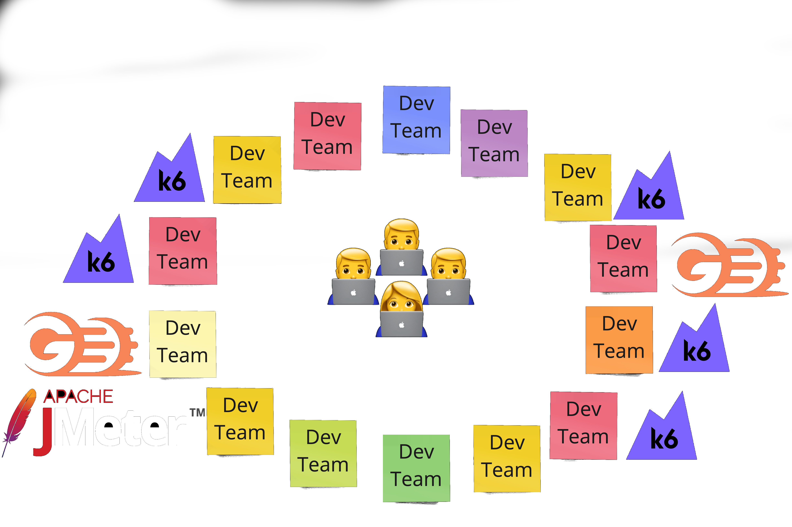

---

# Хранятся данные за годы и строятся тренды

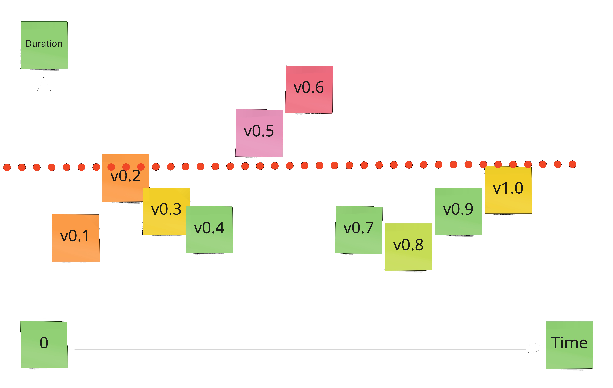

---

# Вы хотите ускорить __InfluxDB__ OSS v1.8 или v2.2

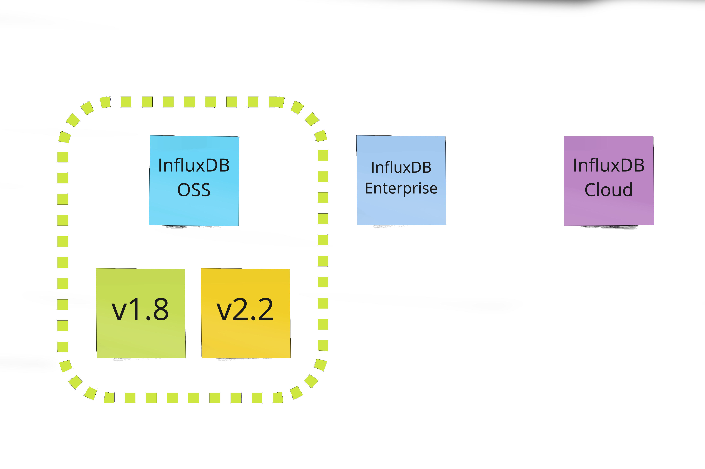


---

# Поменяем разные настройки в разных местах


---
# Оптимизируем запись в __InfluxDB__ c __Telegraf__ и __MQ__


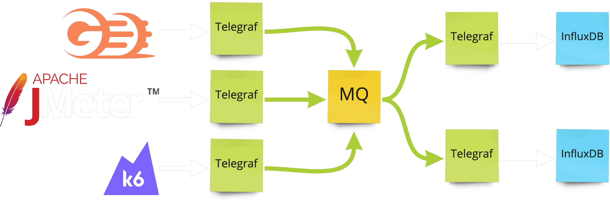


---
# Оптимизируем выборку c __Grafana__ и __nginx__

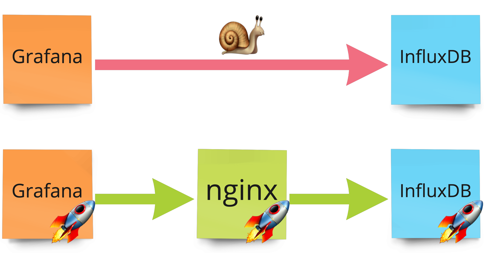


---
# Вычислим медленные запросы

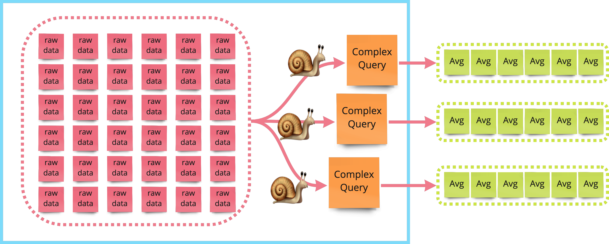

---
# И закешируем их с __Continuous Queries__

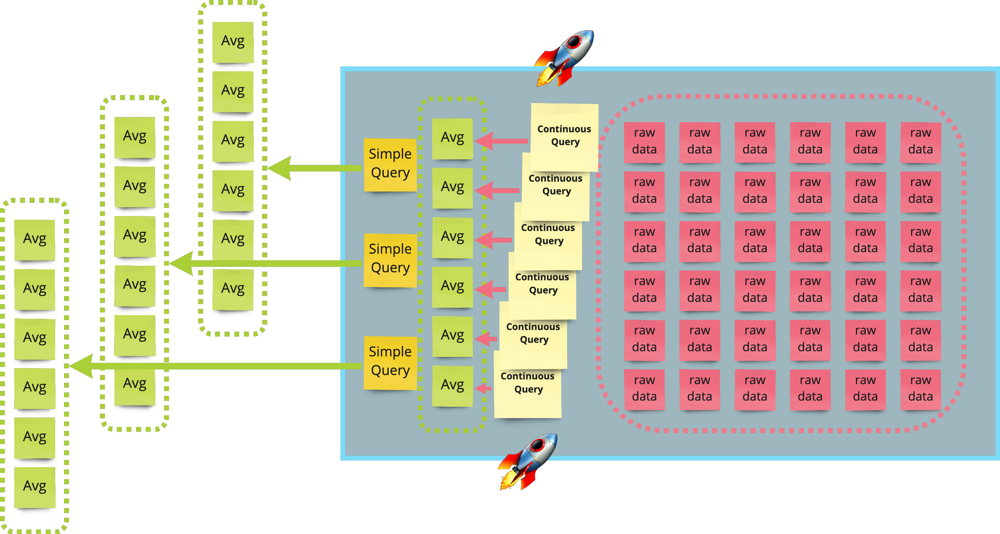


---
<!-- _class: invert -->

# __1.__ ⁉️ Когда оптимизация __InfluxDB__ важна

- Большой продукт

- Вы отвечаете за инфраструктуру тестирования
- Много тестов производительности с __k6__, __JMeter__, __Gatling__, __Yandex.Tank__, ...
- Хранятся данные за годы и строятся тренды
- И вы хотите ускорить __InfluxDB__ OpenSource

---

<!-- _class: main -->

# Простой способ ускорения — разделить индексы

---
# __2.__ ⚙️ Разделение данных на разные базы и серверы __InfluxDB__

- __Разные базы данных__ для команд и стендов

- __Разные серверы__ для новых и архивных данных 
- __Разные сервисы__ для разных данных
- __Получаем__ скорость, __теряем__ простоту построения трендов по всем данным


---
# __Разные базы данных__ для команд и стендов

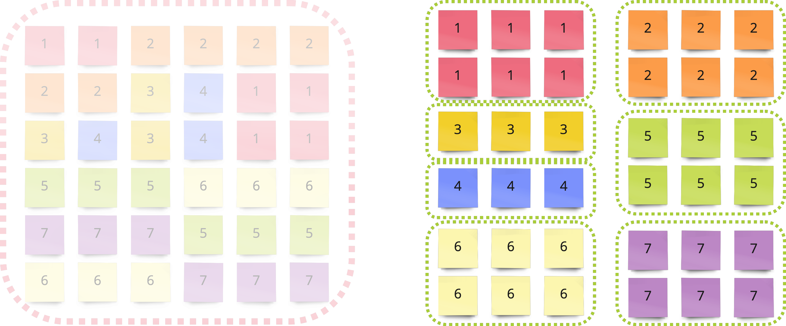


---
# __Разные базы данных__ для команд и стендов


# __Если данные в одной БД__:

- База данных большая
- Нужна фильтрация данных
- Высокий риск повреждения данных


---
# __Разные базы данных__ для команд и стендов


# Если данные в одной БД:

- База данных большая
- Нужна фильтрация данных
- Высокий риск повреждения данных

# __Если данные в разных БД__:

- Бекапы проще
- Фильтрация не нужна
- Сложнее замедлить работу всех БД

---
#  __Разные серверы__ для новых и архивных данных 


---
# __Два сервиса__ c одной активной БД быстрее одного


---
# __Семь контейнеров__ быстрее одного большого?
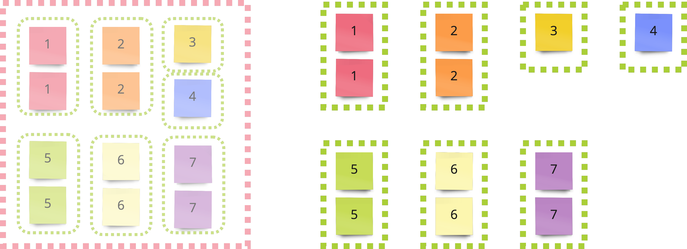

---
# __Семь контейнеров__ быстрее одного большого?


# Да, __быстрее__, 
# но если
# используются не
# все одновременно

---
#  Построение трендов по метрикам из одной БД


## Простые запросы
## для трендов
## по всем метрикам
## с фильтрами и без них

---
#  Скрипты и отдельная БД для общих трендов

## Все еще простые запросы
## для трендов по новым
## метрикам в одной БД.

# __Но сложные механизмы__
## __для трендов по всем__
## __метрикам всех БД.__


---
<!-- _class: invert -->
# __2.__ ⚙️ Разделение данных на разные базы и серверы __InfluxDB__

- __Разные базы данных__ для команд и стендов

- __Разные серверы__ для новых и архивных данных 
- __Разные сервисы__ для разных данных
- __Получаем__ скорость, __теряем__ простоту построения трендов по всем данным

---
# __3.__ ⚙️ «Архивирование»  базы __InfluxDB__ в __Grafana__

- __Grafana__ как реестр активных баз данных

- Перенос файлов базы данных __{name}__ на архивный сервер
- Создание пустой базы данных __{name}-{from}__
- Настройка __Grafana DataSource__ с именем __{name}__ на новую базу данных
- Создание __Grafana DataSource__ для архивной базы данных

---

# __Grafana__ как реестр активных баз данных

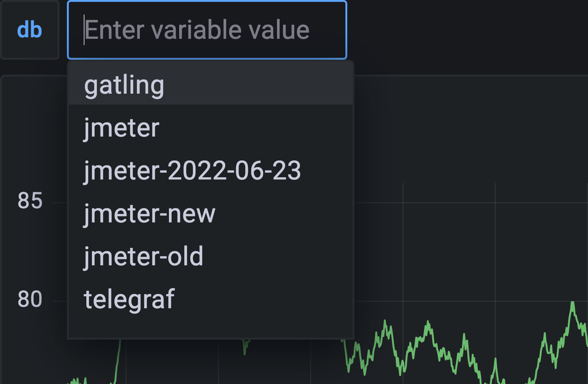

---

# Имеем __DataSource__ с именем "jmeter" в __Grafana__ 

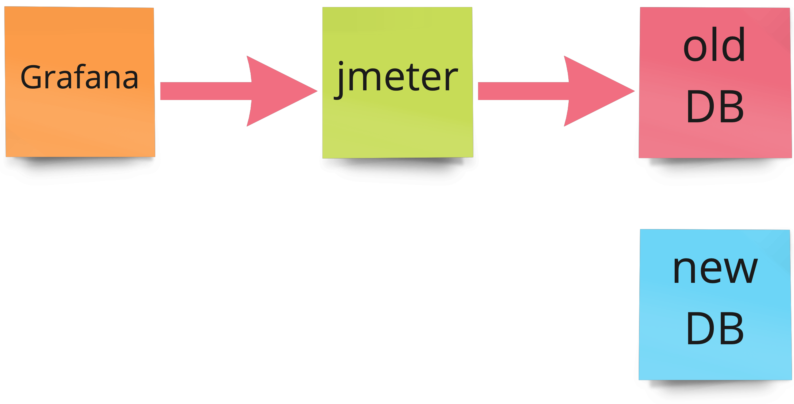

---

# Переключаем __DataSource__ на новую базу данных

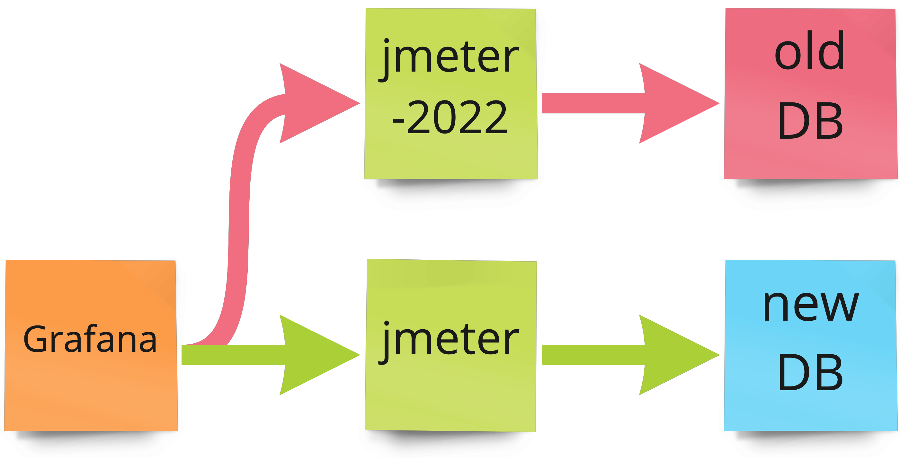

---
<!-- _class: invert -->
# __3.__ ⚙️ «Архивирование» базы __InfluxDB__ в __Grafana__

- __Grafana__ как реестр активных баз данных

- Перенос файлов базы данных __{name}__ на архивный сервер
- Создание пустой базы данных __{name}-{from}__
- Настройка __Grafana DataSource__ с именем __{name}__ на новую базу данных
- Создание __Grafana DataSource__ для архивной базы данных

---

<!-- _class: main -->

# Способ посложнее: сократить запросы к базе

---
# __4.__ 🛠️ Сокращение фильтров по тегам в __Grafana__


---
# Ускорение фильтров заменой __Query__ на __Text__

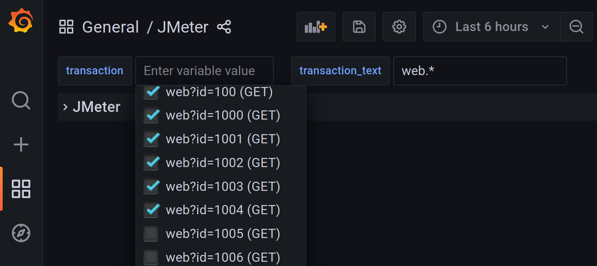


---

<!-- _class: main -->

# Еще сложнее: уменьшим объем метрик


---
# __5.__ ⚙️ Сокращение метрик из __JMeter__, __Gatling__,  ...

- __Batch, batch, batch...__ увеличиваем размер batch'а при вставке

- Не используем переменные в имени запроса

- Замена интервала в __1 секунду__ на __1 минуту__ для тестов дольше __5 минут__

- Во время теста достаточно уровня детализации __summary__

- __SLA__ можно проверять по % ошибок, а __Assertion__ вставить в тест

- Детальный отчет можно формировать после теста


---

# Настройки __Gatling__ по умолчанию

```yaml
gatling {
  data {
    writers = [console, file]

    graphite {
      host = "localhost"
      port = 2003
      #light = false              # only send the all* stats
      #protocol = "tcp"           # "tcp", "udp"
      #rootPathPrefix = "gatling" # the root prefix of the metrics
      #bufferSize = 8192          # internal data buffer size, in bytes
      #writePeriod = 1            # write period, in seconds
    }
  }
}
```

---

# __Batch, batch, batch...__ увеличиваем размер batch'а

# Пусть копим метрики __60 сек__

```yaml
  writers = [console, file, graphite] # +graphite
  graphite {
    host = "localhost"
    port = 2003
    #light = false           
    #protocol = "tcp"        
    bufferSize = 65000       # 🚀 TCP limit 64k (было 8192)
    writePeriod = 60         # 🚀 Batch (было 1) 
  }
```

---

# __Batch, batch, batch...__ 

# Копим метрики __60 сек__, без деталей

```yaml
  writers = [console, file, graphite] # +graphite
  graphite {
    host = "localhost"
    port = 2003
    light = true             # 🚀 без деталей (было false)
    #protocol = "tcp"        
    bufferSize = 65000       
    writePeriod = 60          
  }
```

---

# __Batch, batch, batch...__ 

# Копим метрики __60 сек__, без деталей, с потерями

```yaml
  writers = [console, file, graphite] # +graphite
  graphite {
    host = "localhost"
    port = 2004              # udp-порт (было 2003)
    light = true             
    protocol = "udp"         # 🚀 с потерями (было tcp)
    bufferSize = 65000       
    writePeriod = 60          
  }
```
---

# Настройки __JMeter__ по умолчанию

```yaml
QUEUE_SIZE=5000 # Async Queue size
# Backend metrics window mode (fixed=fixed-size window, timed=time boxed)
backend_metrics_window_mode=fixed
# Backend metrics sliding window size for Percentiles, Min, Max
backend_metrics_window=100

# Backend metrics sliding window size for Percentiles, Min, Max
# when backend_metrics_window_mode is timed
# Setting this value too high can lead to OOM
# backend_metrics_large_window=5000
# Send interval in second
# Defaults to 5 seconds
backend_influxdb.send_interval=5
```

---

# __Batch, batch, batch...__ увеличиваем размер batch'а

# Пусть у нас __1200 rps__ и копим метрики __60 сек__

```yaml
QUEUE_SIZE=72000 # 1200x60, было 5000, Async Queue size
```
Конфиг для `backend_metrics_window_mode=fixed` __(не очищается)__:
```yaml
backend_influxdb.send_interval=60 # было 5
backend_metrics_window=72000 # 1200x60, было 100
```
Конфиг для `backend_metrics_window_mode=timed` __(очищается 🚀)__:
```yaml
backend_influxdb.send_interval=60 # было 5
backend_metrics_large_window=72000 # 1200x60, было 5000
```


---

# __JMeter__-сценарий, с медленной статистикой

```java
var plan =  scenario.sendHttp(
  testId: getTestId(linksCount), 
  linksCount: linksCount, 
  nameOfSampler: "web?id=${id} (GET)" //переменная ${id} в имени
);
```
## Получим много тегов в __InfluxDB__ и большой индекс:

- `web?id=0 (GET)`
- `web?id=1 (GET)`
- ...
- `web?id=1000000 (GET)`

---
<!-- _class: error  -->

# Или вообще ничего  не запишем: __ERROR__ org.apache.jmeter.visualizers.backend.influxdb

```
failed to send data to influxDB server.

Error writing metrics to influxDB Url: 
http://influxdb:8086/write?db=jmeter100000, 
responseCode: 400, responseBody:  {"error": "partial write:
  max-values-per-tag limit exceeded (100000/100000): 
  measurement=\"jmeter\" tag=\"transaction\" 
  value=\"web?id=19806 (GET)\" dropped=2"}

Error writing metrics to influxDB Url: 
http://influxdb:8086/write?db=jmeter100000, 
responseCode: 413, responseBody: {"error":"Request Entity Too Large"}
```
---

# Не используем переменные в имени запроса


```java
var plan =  scenario.sendHttp(
  testId: getTestId(linksCount), 
  linksCount: linksCount, 
  nameOfSampler: "web?id={id} (GET)" //вот так быстрее
);
```
## Получим один тег в __InfluxDB__ и малый индекс:

- `web?id={id} (GET)`

---

# __SLA__ можно проверять по % ошибок (в __summary__)
# __Assertion__ на длительность вставить в тест

- для запросов в JMeter: [__Duration Assertion__](https://jmeter.apache.org/usermanual/component_reference.html#Duration_Assertion)
- для транзакций в JMeter: [__JSR-223 Listener__](https://gist.github.com/polarnik/7f5fdc5c70809c879dd42904b8639f31)
```
jmeter.apache.org/usermanual/component_reference.html#Duration_Assertion
gist.github.com/polarnik/7f5fdc5c70809c879dd42904b8639f31
```
- для запросов в Gatling: [__`.check(responseTimeInMillis.lte(100))`__](https://gatling.io/docs/gatling/reference/current/core/check/#responsetimeinmillis)
- для теста в Gatling: [__Assertions__](https://gatling.io/docs/gatling/reference/current/core/assertions/)

```
gatling.io/docs/gatling/reference/current/core/check/#responsetimeinmillis
gatling.io/docs/gatling/reference/current/core/assertions/
```

---

<!-- _class: invert  -->

# __5.__ ⚙️ Сокращение метрик из __JMeter__, __Gatling__, ...

- __Batch, batch, batch...__ увеличиваем размер batch'а при вставке

- Замена интервала в __1 секунду__ на __1 минуту__ для тестов дольше __5 минут__

- Во время теста достаточно уровня детализации __summary__

- __SLA__ можно проверять по % ошибок, а __Assertion__ вставить в тест

- Детальный отчет можно формировать после теста


---

<!-- _class: main -->

# Ускорение выборки из __InfluxDB__ через __Grafana__ с __nginx__

---
# __6.__ ⚙️ Кеширование  ответов от __InfluxDB__ с __nginx__ 

- Кеширование __GET__-запросов к __/query__ в __nginx__
- Настраиваем __DataSource__ в __Grafana__ на метод __`GET`__ и __`http://nginx:80`__

- Влияние интервалов времени __Grafana__ на кеширование
- Замена относительного интервала вида __`now()-6h...now()`__ абсолютным

---


---

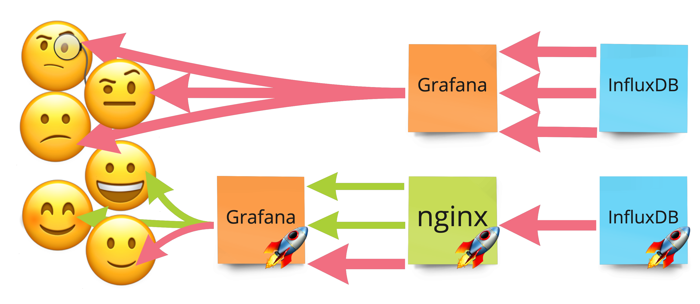

---

# __InfluxDB__ endpoints: кешируем запросы

- __`https://docs.influxdata.com/influxdb/v1.8/tools/api/`__
- /debug/pprof (GET)
- /debug/requests (GET)
- /debug/vars (GET)
- /ping (GET, HEAD)
- __/query (GET, POST)__ ‼️
- /write (POST)
- /metrics (GET)
- /api/v2/query (POST)
- /api/v2/write (POST)
- /health (GET)

---

# __InfluxDB__ endpoint __/query__ (GET, POST)

- GET:
  - __SELECT__ ‼️
  - __SHOW__ ‼️

- POST:
  - SELECT INTO
  - ALTER
  - CREATE
  - DELETE
  - DROP
  - GRANT
  - KILL
  - REVOKE

---

# Часть __nginx.conf__ для кеширования __/query__ (__GET__)

```yaml
        location /query {
            proxy_cache mycache;
            proxy_cache_key "$host$request_uri";
            proxy_cache_min_uses 1;
            proxy_cache_methods GET;
            proxy_cache_valid 200 302 10m;
            proxy_pass http://influxdb:8086;
            proxy_cache_background_update on;
            proxy_cache_revalidate on;
            proxy_cache_lock on;
            add_header X-Cache-Status $upstream_cache_status;
        }
```
---

# Настраиваем __DataSource__  на __`http://nginx`__ (__GET__)

/provisioning/datasources/jmeter_cache.yaml
```yaml
apiVersion: 1
datasources:
  - name: jmeter_cache    # Имя DataSource в Grafana
    type: influxdb        # InfluxQL
    access: proxy         # Server
    database: jmeter      # Имя базы данных в InfluxDB
    url: http://nginx:80  # 👉 Адрес кеширующего сервера
    jsonData:
      httpMode: GET       # 👉 Метод GET
    basicAuth: false      # 🤷‍♂️ Без аутентификации

```
---

# Важен __статический интервал__ для кеширования

# __Абсолютный:__


# Не относительный: 


---

# Относительный интервал __Last 6 hours__ UTC:

```bash
curl -G 'http://influxdb:8086/query?db=mydb' --data-urlencode \
  'q=SELECT * FROM "metrics" \
  where time>1655827200000 AND time<1655848800000'
```

# Каждую милисекунду дает новый диапазон:
```bash
curl -G 'http://influxdb:8086/query?db=mydb' --data-urlencode \
  'q=SELECT * FROM "metrics" \
  where time>1655827230023 AND time<1655848830023' #+30023=+30s
```
# А это уже новый __URL__, новый ключ кеширования


---


# Ссылка в __Grafana Text (HTML)__ для автоматизации

```html
<h2> 
<a href="/d/${__dashboard}/?from=${__from}&to=${__to}&${db:queryparam}">
Select static time interval
</a>
</h2>
```


---
<!-- _class: invert -->
# __6.__ ⚙️ Кеширование  ответов от __InfluxDB__ с __nginx__

- Кеширование __GET__-запросов к __/query__ в __nginx__
```
location /query { proxy_pass http://influxdb:8086; }
```
- Настраиваем __DataSource__ в __Grafana__ на метод __GET__ и __http://nginx:80__

- Влияние интервалов времени __Grafana__ на кеширование
- Замена относительного интервала вида __`now()-6h...now()`__ абсолютным

```
/d/${__dashboard}/?from=${__from}&to=${__to}&${db:queryparam}
```
# Ускорение с 10 сек до 10 мсек (__х 1000__)

---

<!-- _class: main -->

# Кеширование с __nginx__ ускоряет до __1000__ раз

---

<!-- _class: main -->

# Мониторинг, чтобы закопаться в метрики __InfluxDB__

---
# __7.__ 📊 Мониторинг производительности __InfluxDB__

- Мониторинг общесистемных метрик
  - CPU и __память__ 
  - Нехватка памяти для __InfluxDB__ и перезапуски

- Мониторинг внутренних метрик __InfluxDB__ из базы данных **__internal**
  - Размеры шард __InfluxDB__
  - Количество значений тегов
  - Количество конкурентных запросов к __InfluxDB__


---
# Мониторинг общесистемных метрик

# __CPU__ ~= Количество одновременных __query__
# __RAM__ ~= Размер задействованных __shard__


---
# Мониторинг внутренних метрик __InfluxDB__ из базы данных **__internal**

# __shard__ : __path__ : __size__ : размеры индексов

# __database__ : __numSeries__ : количество значений тегов

# __httpd__ :  количество и длительность запросов


---
# Размеры shard'ов __InfluxDB__

# __Shard__ — часть индекса, например, за 1 час

```sql
CREATE DATABASE "jmeter" 
WITH DURATION INF REPLICATION 1 
  SHARD DURATION 1h NAME "autogen";
```


## __ОЗУ__ ~= Размер shard'ов в памяти (метрики __`shard`__)

---
# Размеры shard'ов __InfluxDB__ в памяти из __shard__

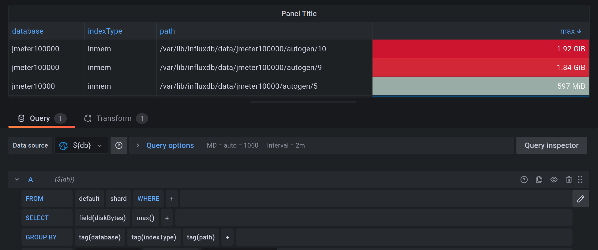

---

# __database__ : __numSeries__ : количество значений тегов

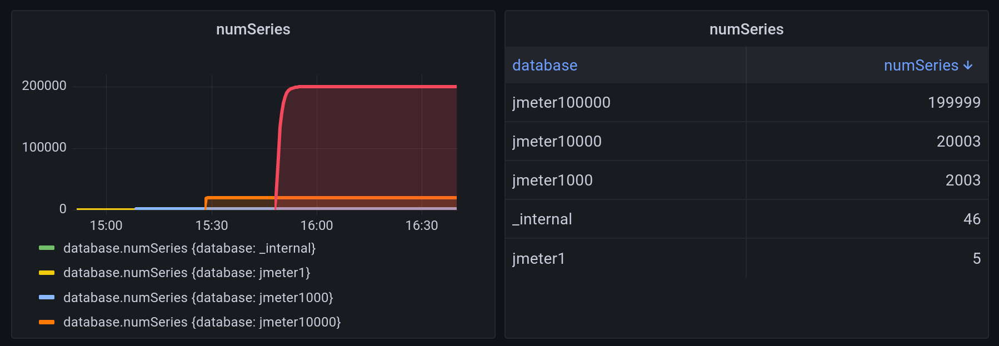

---
# Количество конкурентных запросов к __InfluxDB__

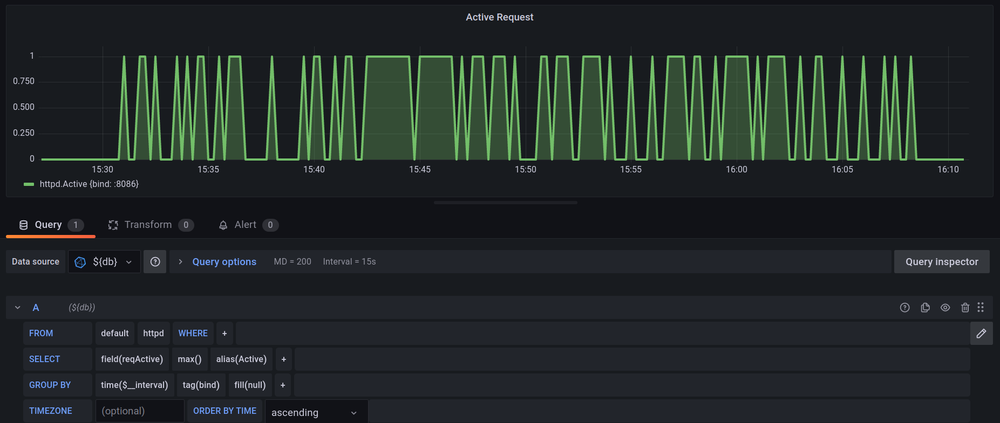


---
<!-- _class: invert -->
# __7.__ 📊 Мониторинг производительности __InfluxDB__

- Мониторинг общесистемных метрик
  - CPU и __память__ 
  - Нехватка памяти для __InfluxDB__ и перезапуски
  
- Мониторинг внутренних метрик __InfluxDB__ из базы данных **__internal**
  - Размеры shard'ов __InfluxDB__
  - Количество значений тегов
  - Количество конкурентных запросов к __InfluxDB__


---

<!-- _class: main -->

# Конфигурирование ограничений в __InfluxDB__ по данным мониторинга


---
# __8.__ ⚙️ Конфигурирование сервера __InfluxDB__

- Ограничиваем __`max-concurrent-queries`__
  - Ограничиваем __`max_conns`__ в __nginx__ upstream
- Ограничиваем __`query-timeout`__
- Ограничиваем __`max-select-series`__
- Ограничиваем __`max-select-buckets`__
- Изменение типа индекса с __`inmem`__ на __`tsi1`__
- Логирование узких мест c __`log-queries-after`__


---

# Ограничиваем __max-concurrent-queries__

```yaml
[coordinator]
  # The maximum number of concurrent queries 
  # allowed to be executing at one time.  
  # If a query is executed and exceeds this limit, 
  # an error is returned to the caller.  
  # This limit can be disabled by setting it to 0.
  max-concurrent-queries = 5
```

---

# Ограничиваем __query-timeout__

```yaml
[coordinator]
  # The maximum time a query will is allowed 
  # to execute before being killed by the system.  
  # This limit can help prevent run away queries.  
  # Setting the value to 0 disables the limit.
  query-timeout = "60s"
```

# Рассчитывайте на __100__ МБайт аллокаций в сек
# Если памяти __6000__ МБайт, то __60s__ - предел

---

<!-- _class: error
-->

# Ошибка при достижении __query-timeout__

### query-timeout limit exceeded

```sql
SELECT mean(avg) 
FROM jmeter 
WHERE 
  time>1656242940000000000 and 
  time<1656242940000000000+10m 
GROUP BY time(1m), transaction, statut, testid
```


---

# Оцениваем предельное количество тегов ответа

Пусть есть:

- 5000 значений __transaction__ 
- 2 значения __statut__ (ok, ko)
- 10 000 комбинаций (__серий__) всего

И мы допускам запросы по всем значениям:

```sql
SELECT mean(avg) FROM "jmeter"
```

В лимитах выставляем __5000 х 2 + чуть-чуть__

---

# Ограничиваем __`max-select-series`__

```yaml
[coordinator]
  # The maximum number of series a SELECT can run. 
  # A value of 0 will make the maximum series
  # count unlimited.
  
  # max-select-series = 0
  max-select-series = 10100
```

---

<!-- _class: error
-->

# Ошибка при достижении __`max-select-series`__

### max-select-series limit exceeded: (10101/10100)

```sql
SELECT mean(avg) 
FROM "jmeter"
```


---

# Оцениваем предел группировки по времени

# Примерно 11-12 точек
```sql
select mean(avg) 
from jmeter 
where 
  time>1656242940000000000 and 
  time<1656242940000000000+10m 
group by time(1m)
```

# А на мониторе __1920__ точек в ширину — больше пользователь не увидит


---

# Ограничиваем __`max-select-buckets`__

```yaml
[coordinator]
  # The maxium number of group by 
  # time bucket a SELECT can create.
  # A value of zero will max the maximum 
  # number of buckets unlimited.
  
  # max-select-buckets = 0
  max-select-buckets = 1920
```
---

<!-- _class: error
-->

# Ошибка при достижении __`max-select-buckets`__

```sql
select mean(avg) 
from jmeter 
where 
  time>1656242940000000000 and 
  time<1656242940000000000+10m 
group by time(1ms)
```

### ERR: max-select-buckets limit exceeded: (600000/1920)


---
# Изменение типа индекса с __`inmem`__ на __`tsi1`__

# Если хотим сохранять тысячи значений тегов

```yaml
[data]
  # The type of shard index to use for new shards.  
  # The default is an in-memory index that is
  # recreated at startup.  
  # A value of "tsi1" will use a disk based index 
  # that supports higher cardinality datasets.
  index-version = "tsi1"
```

---

# Логирование узких мест c __`log-queries-after`__

```yaml
[coordinator]
  # The time threshold when a query will be 
  # logged as a slow query.  
  # This limit can be set to help
  # discover slow or resource intensive queries.  
  # Setting the value to 0 disables the slow query logging.
  log-queries-after = "2s"
```

---
<!-- _class: invert -->
# __8.__ ⚙️ Конфигурирование сервера __InfluxDB__

- Ограничиваем __`max-concurrent-queries`__
  - Ограничиваем __`max_conns`__ в __nginx__ upstream
- Ограничиваем __`query-timeout`__
- Ограничиваем __`max-select-series`__
- Ограничиваем __`max-select-buckets`__
- Изменение типа индекса с __`inmem`__ на __`tsi1`__
- Логирование узких мест c __`log-queries-after`__

# Не ускоряет, но повышает стабильность


---

<!-- _class: main -->

# Профилирование досок __Grafana__, анализ запросов к __InfluxDB__


---
# __9.__ 🔬 Анализ логов __InfluxDB__

```yaml
[coordinator]
  # The time threshold when a query will be logged as a slow query.  
  # This limit can be set to help
  # discover slow or resource intensive queries.  
  # Setting the value to 0 disables the slow query logging.
  log-queries-after = "2s"
```
```
Detected slow query: 
  SELECT top(avg, 3) FROM jmeter 
  WHERE time >= now() - 1d AND time <= now() 
  GROUP BY time(1m), application, transaction, statut 
  (qid: 27, database: jmeter10000, threshold: 2s)
```

---
# __10.__ 🔬 Замер длительности ответа на запрос из __Grafana__ в __InfluxDB__: Access __Browser__, Method __POST__
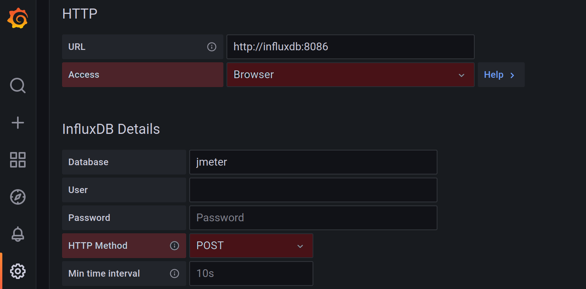

---

# Выявляем медленный и частый запрос

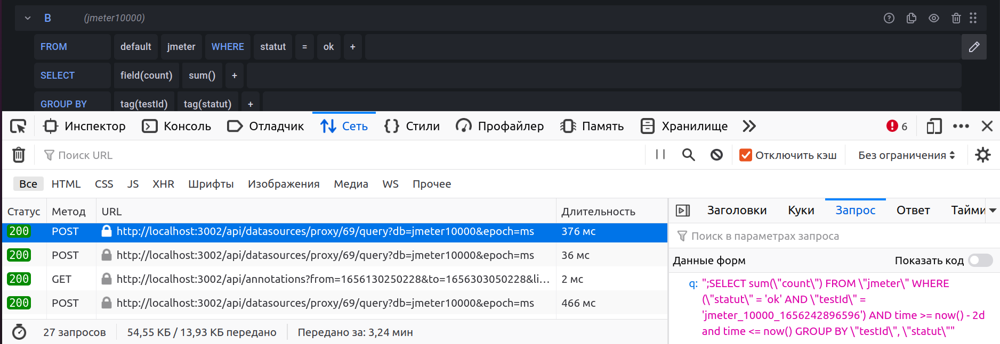

---

#  Среднее время отклика за тест

```sql
SELECT mean(avg) 
FROM jmeter
WHERE 
  statut = 'ok' AND
  time > now()-10d AND time < now()
GROUP BY testId, time(1d)
```

---


---
# __11.__ 🚀 Подготовка данных для ответа с помощью __Continuous Queries__

```sql
CREATE
  CONTINUOUS QUERY cq_mean_avg_query_1d ON jmeter10000
  RESAMPLE EVERY 10m FOR 1d
BEGIN
    SELECT   mean(avg) AS avg
    INTO     jmeter10000."archive".jmeter_1d
    FROM     jmeter10000."autogen".jmeter
    GROUP BY testId, time(1d, 0s)
END;

```

---


---

#  Запрос становится быстрее

```sql
SELECT last(avg)
FROM   "archive".jmeter_1d
WHERE  time > now()-10d AND time < now()
GROUP BY testId, time(1d)
----------------------------------------
----------------------------------------
SELECT mean(avg)
FROM   jmeter
WHERE  statut = 'ok' AND
       time > now()-10d AND time < now()
GROUP BY testId, time(1d);
```


---
# ‼️ Сокращайте количество __Continuous Queries__

# __CQ__ не кешируются с __nginx__
# Не нужно делать слишком много __CQ__
# Не нужно делать __CQ__, которые работают с большими shard'ами (год — много, достаточно дня)

---
# Путь к __Continuous Queries__ 

- 🔬 Анализ логов __InfluxDB__

```
log-queries-after = "2s"
```

- 🔬 Замер длительности ответа на запрос из __Grafana__ в __InfluxDB__

```
Grafana Datasource: Access Browser, Method POST + WebConsole
```

- 🚀 Подготовка данных для ответа с помощью __Continuous Queries__

```sql
RESAMPLE EVERY 10m FOR 1d
```

---

<!-- _class: main -->

# Ускорение записи в __InfluxDB__ со стороны источника метрик и альтернативы

---
# Одновременная запись метрик может тормозить

# 🐌 🤔

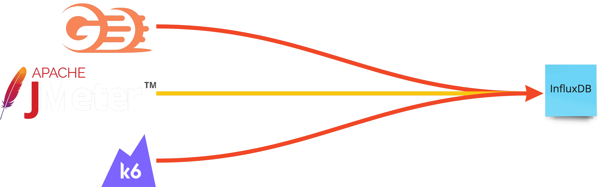

---
# Оптимизируем запись в __InfluxDB__ c __Telegraf__ и __MQ__

# 🚀 😀 


---
# __12.__ ⚙️ Смена БД __InfluxDB__ v1.8, __InfluxDB__ v2, __VictoriaMetrics__ или __ClickHouse__

## __InfluxDB__ v2 использует быстрый движок

## __VictoriaMetrics__ кеширует ответы и жмет данные

## __ClickHouse__ быстр (при наличии памяти) и удобен

## 🚀 Разгонный потенциал __InfluxDB__ v1.8 огромен 

---
<!-- _class: invert -->

# Содержание

1. ⁉️ Когда оптимизация __InfluxDB__ важна
1. ⚙️ Разделение данных на разные базы и серверы __InfluxDB__
1. ⚙️ «Архивирование»  базы __InfluxDB__ в __Grafana__
1. 🛠️ Сокращение фильтров по тегам в __Grafana__
1. ⚙️ Сокращение метрик из __JMeter__, __Gatling__, ...
1. ⚙️ Кеширование  ответов от __InfluxDB__ с __nginx__ 
1. 📊 Мониторинг производительности __InfluxDB__
1. ⚙️ Конфигурирование сервера __InfluxDB__
1. 🔬 Анализ логов __InfluxDB__
1. 🔬 Замер длительности ответа на запрос из __Grafana__ в __InfluxDB__
1. 🚀 Подготовка данных для ответа с помощью __Continuous Queries__
1. ⚙️ Смена БД __InfluxDB__ v1.8, __InfluxDB__ v2, __VictoriaMetrics__ или __ClickHouse__
---
<!-- _class: main
-->

# Делите, кешируйте, ускоряйте! 

### `https://github.com/polarnik/influxdb-bench`

---
<!-- _class: invert
-->
<!-- 
_footer: '`https://github.com/polarnik/influxdb-bench`'
-->


# Ускорение __InfluxDB__, Смирнов Вячеслав, __@qa_load__

# Feedback :

# 🙂 👍 👉

# 👀 🎦 🍿


